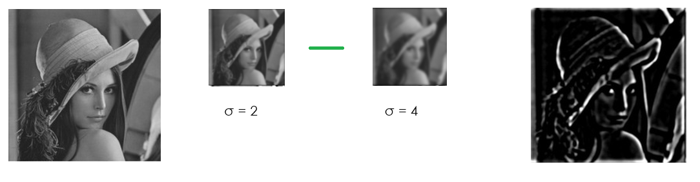
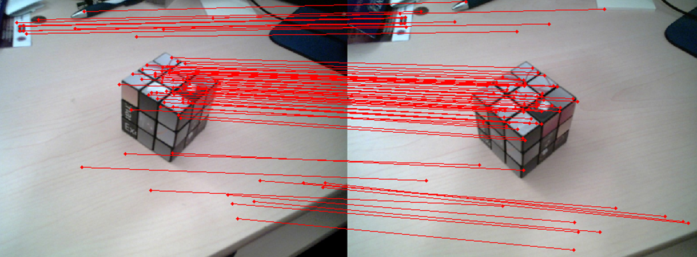
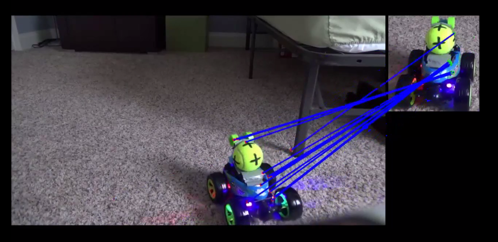
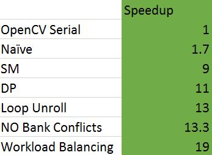
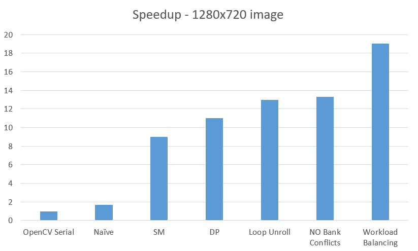
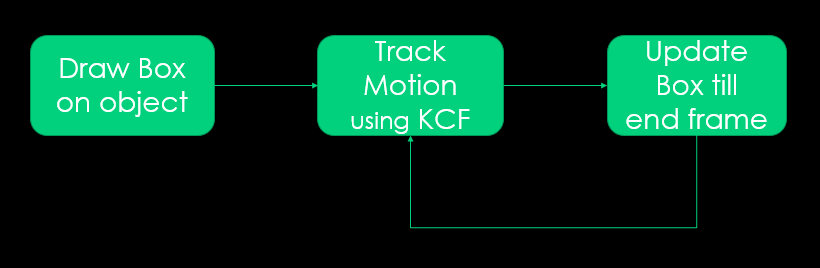
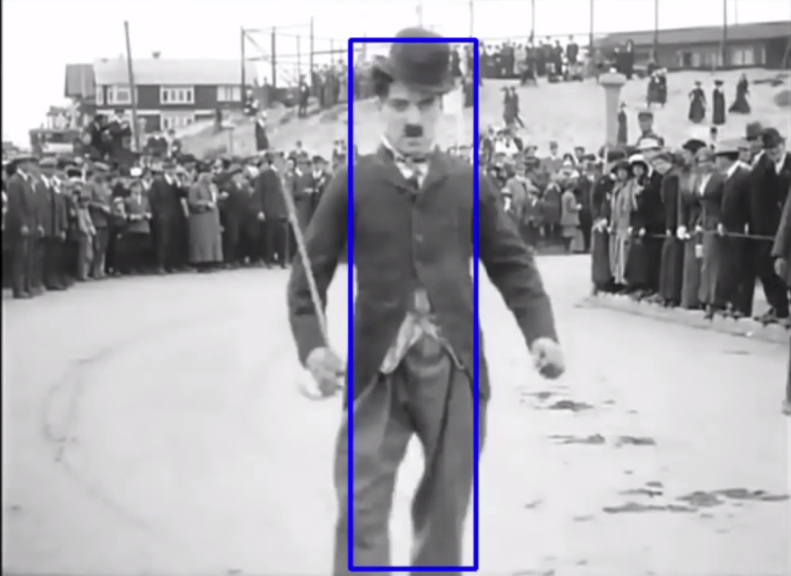
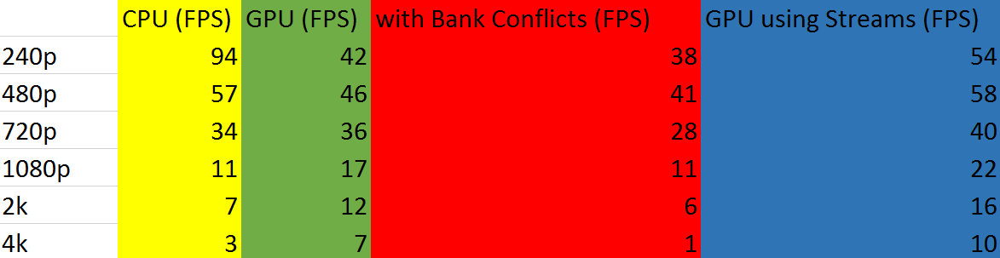
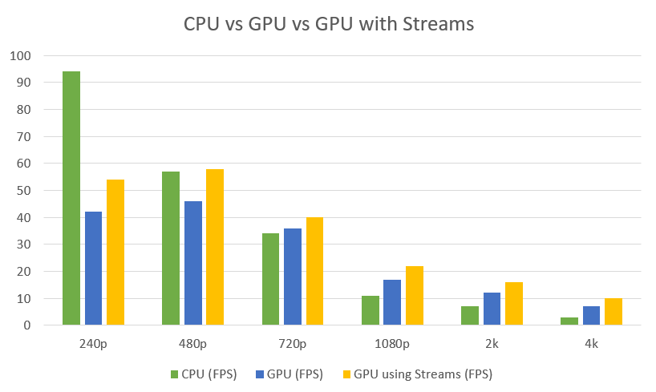

CUDA Feature Matching and Object Tracking
=========================================

**University of Pennsylvania, CIS 565: GPU Programming and Architecture, Final Project**

* Yash Vardhan
* Tested on: Windows 10 Pro, Intel i5-4200U (4) @ 2.600GHz 4GB, NVIDIA GeForce 840M 2048MB

In this project, I will implement the following computer vision algorithms on GPUs and CPUs:
* Feature Matching
* Object Tracking

# Feature Matching

Feature Matching pipeline:

### Feature Detection :
Finds the Corner points (movement invariant) by  
* Using Difference of Gaussians (DoG) method with different width parameters (σ) and different scales of images to detect corner points.
* Scan for local minima/maxima, calculate Hessian and apply curve test. 

### Feature Description : 
Describes the area around detected corner points between 2 images to be matched by
* Creating a patch by taking 256 points around keypoint.
* For all pairs in patch create binary string by: Intensity(p1) > Intensity(p2).

### Feature Matching :
Matches keypoints between 2 images while removing outliers by
* Calculating Hamming distance between all keypoint descriptors in 2 images.
* Using k-Nearest Neighbors to get nearest match and remove outliers by applying False Positive Ratio Test.

### Results :

### Performance Analysis :

# Object Tracking

Object Tracking pipeline:

### Initialization : 
Draws a box around the object to be tracked in the initial frame.

### Tracking : 
Runs the KCF tracking algorithm on the object inside the box and the position in next frame and re-draw the box on the new identified position of the object in the new frame and REPEATS.

### Kernelized Corelation Filters(KCF) :
* Object Detection in box : In this step the Gaussian Kernel and FFT is done on the box to detect the object.
* Descriptor Matrices Calculation : This step involves the calculation of raw input features which will be used in the learning algorithm.
* Reduce dimensions of descriptors using PCA : Initially the dimensions of the feature are too high and less informative. To handle this scenario, dimensionality reduction is performed on this raw sets of features in the form of Principal Component Analysis.
* Perform Kernel Regression on updated features which gives new position for bounding box. This is the actual learning algorithm.

### Results :

### Performance Analysis :

# References
* http://ieeexplore.ieee.org/document/7284011/
* http://ieeexplore.ieee.org/document/6935620/
* https://opencv.org/
* http://opencv-python-tutroals.readthedocs.io/en/latest/py_tutorials/py_feature2d/py_feature_homography/py_feature_homography.html
